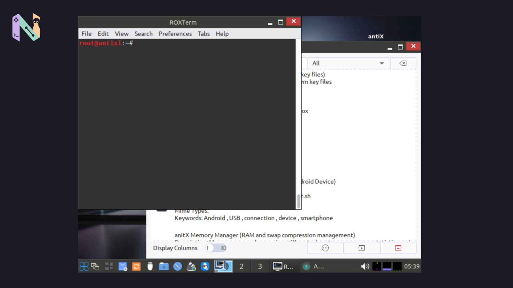

antiX 26.1 baru saja dirilis. Jangan berharap ada perubahan besar di versi ini karena rilisnya memang lebih fokus ke maintenance, mulai dari perbaikan bug sampai pembaruan kernel.

Buat ane, bagian yang paling menarik justru bukan tampilannya, tapi pilihan kernel dan konsistensi antiX yang masih bertahan tanpa systemd. Jadi kalau ente memang suka distro ringan atau punya PC lawas yang masih pengin dihidupin, rilis ini cukup menarik buat dilihat.

## Masih Pakai Debian 13

antiX 26.1 masih menggunakan Debian 13 "Trixie" sebagai basisnya. Paket-paket dari repositori Debian juga sudah mendapatkan pembaruan, jadi pengguna versi sebelumnya tetap mendapatkan berbagai update dari basis sistemnya.

Tapi kalau ngomongin perubahan yang paling kelihatan, ane lebih tertarik ke bagian kernel.

Untuk edisi Core, antiX menggunakan Linux kernel 5.10.256 LTS yang sudah dikustomisasi. Sementara untuk edisi Full 64-bit, kernel yang digunakan adalah Linux 6.6.139 LTS.

Pilihan ini cukup masuk akal karena antiX memang punya target pengguna yang luas. Kernel 5.10 masih bisa jadi pilihan buat mesin lawas, sedangkan kernel 6.6 memberikan dukungan yang lebih baru buat hardware yang relatif modern.

## Beberapa Bug Sudah Dibereskan

Karena ini maintenance release, salah satu fokus antiX 26.1 memang ada di perbaikan bug yang ditemukan sejak seri antiX 26 sebelumnya.

Ada satu catatan yang menurut ane perlu diperhatikan kalau ente sehari-hari pakai mouse Bluetooth.

Tim antiX masih mencatat adanya masalah di mana mouse Bluetooth bisa saja tidak langsung terdeteksi pada konfigurasi tertentu. Jadi kalau nanti setelah update mouse Bluetooth tiba-tiba tidak mau muncul, jangan buru-buru mengira perangkatnya rusak.

Masalah tersebut memang masih menjadi known issue di rilis ini.

## Tetap Nggak Mau Pakai systemd

Nah, ini bagian yang dari dulu bikin antiX menarik buat para pengoprek Linux.

antiX 26.1 tetap berjalan tanpa systemd, libsystemd0, elogind, maupun libelogind0. Sebagai gantinya, mereka masih menggunakan eudev.

Untuk urusan init system juga pilihannya lumayan banyak. Secara default antiX menggunakan runit, tetapi pengguna juga bisa memilih sysVinit, dinit, s6-rc, atau s6-66.

Buat yang belum pernah ngulik soal init system, sederhananya ini adalah bagian yang bertugas memulai berbagai proses ketika Linux melakukan booting.

Kebanyakan distro Linux modern memang sudah menggunakan systemd. Tapi antiX memilih jalan yang berbeda dan tetap menyediakan beberapa alternatif init system untuk pengguna yang memang membutuhkan pendekatan seperti ini.

Buat PC dengan RAM terbatas, pendekatan antiX seperti ini memang menarik untuk dicoba. Bukan berarti setiap distro tanpa systemd otomatis lebih cepat di semua kondisi, tapi setidaknya antiX memang dari awal dibangun dengan tujuan supaya sistemnya tetap ringan.

## Tampilan Klasik, Tapi Aplikasinya Lengkap

Kalau ente terbiasa dengan Ubuntu, Fedora, atau distro lain yang langsung menawarkan GNOME atau KDE Plasma, tampilan antiX bakal terasa cukup berbeda.

Window manager bawaan yang digunakan adalah IceWM. Tampilannya memang sederhana dan agak klasik, tetapi justru itu salah satu alasan antiX bisa tetap ringan.

Kalau IceWM bukan selera ente, masih ada pilihan seperti Fluxbox, JWM, sampai beberapa tiling window manager seperti herbstluftwm.

Untuk aplikasi bawaan juga sebenarnya cukup lengkap.

Ada zzzFM dan rox-filer untuk urusan file manager, Celluloid dan MPV untuk multimedia, LibreOffice untuk pekerjaan kantor, serta Firefox untuk browsing.

antiX juga menyediakan beberapa tool khusus seperti iso-snapshot untuk membuat snapshot sistem, Package Installer, dan ddm-mx yang bisa membantu pemasangan driver NVIDIA.

Untuk kebutuhan audio, rilis ini juga sudah menyediakan PipeWire, WirePlumber, dan ALSA.

## Nggak Perlu Install Ulang

Kalau ente sudah menggunakan antiX 26 sebelumnya, kabar baiknya tidak perlu install ulang hanya untuk mendapatkan versi 26.1.

Pembaruan bisa didapat melalui update sistem seperti biasa.

Sementara buat yang baru mau mencoba antiX, ISO-nya tersedia dalam beberapa pilihan. Ada edisi Full kalau ingin langsung mendapatkan sistem dengan berbagai aplikasi bawaan, dan ada Core buat yang memang ingin membangun sistemnya sendiri dari awal.

Keduanya juga masih tersedia untuk arsitektur 32-bit dan 64-bit, ente bisa download isonya di [website official antiX Linux](https://antixlinux.com/download/).

Nah, dukungan 32-bit ini menurut ane masih menjadi salah satu alasan menarik untuk melirik antiX. Di saat banyak distro Linux sudah meninggalkan perangkat 32-bit, antiX masih memberikan pilihan buat orang yang punya PC lawas dan ingin memberinya kesempatan hidup lagi.

Memang, PC jadul dengan RAM kecil tidak akan tiba-tiba berubah menjadi komputer kencang hanya karena dipasang antiX. Tapi kalau perangkatnya masih sehat dan kebutuhan ente cuma sebatas browsing ringan, mengetik, atau sekadar ngulik Linux, distro seperti ini masih punya tempat.

Dan justru di situlah antiX 26.1 terasa menarik. Tidak banyak perubahan besar, tidak membawa tampilan yang heboh, tetapi tetap mempertahankan pendekatan yang dari dulu menjadi cirinya: ringan, fleksibel, dan tidak bergantung pada systemd.
