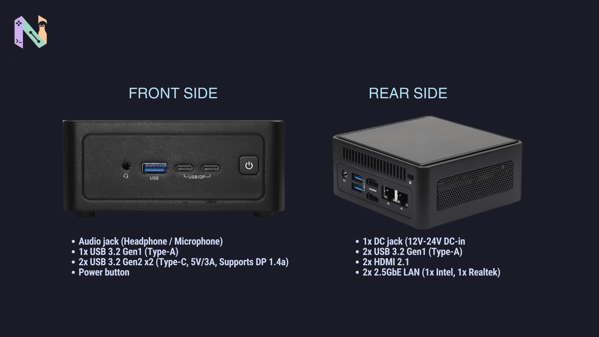

ASRock baru saja memperkenalkan NUC Core 300 BOX Series, mini PC yang menggunakan prosesor Intel Wildcat Lake. Kalau cuma melihat bentuk dan spesifikasinya sekilas, mungkin tidak ada yang terlalu aneh.

Tapi setelah melihat prosesor yang digunakan, ada satu bagian yang cukup bikin penasaran. Intel Core 3 304 yang dipakai salah satu variannya ternyata hanya memiliki lima core.

Lima core?

Angka ini memang terdengar agak tidak biasa kalau melihat prosesor sekarang yang jumlah core-nya lebih sering genap.

## Core 3 304 Punya 1 P-Core dan 4 E-Core

Setelah dilihat lebih jauh, lima core tersebut ternyata memang konfigurasi yang sengaja dibuat seperti itu.

Intel Core 3 304 memiliki satu Performance Core (P-Core) dan empat Efficient Core (E-Core). Jadi totalnya lima core.

Sementara varian di atasnya, Core 5 320, punya enam core yang terdiri dari dua P-Core dan empat E-Core.

Di titik ini mungkin muncul pertanyaan, kenapa Intel membuat konfigurasi seperti itu?

Jawabannya ternyata berkaitan dengan target perangkatnya.

## ASRock NUC Core 300 Memang Bukan Mini PC Biasa

NUC Core 300 Series dari ASRock Industrial ini memang bukan mini PC yang ditujukan khusus untuk pengguna rumahan kalau saya baca dari [notebookcheck](https://www.notebookcheck.net/Compact-mini-PCs-with-up-to-64-GB-DDR5-RAM-and-Intel-Core-300-CPUs-go-official.1400268.0.html).

Perangkat tersebut menyasar kebutuhan seperti edge computing, sistem industri, dan perangkat embedded. Jadi yang dicari bukan sekadar jumlah core sebanyak mungkin, melainkan kombinasi performa, konsumsi daya, konektivitas, dan ukuran perangkat.

Prosesornya sendiri memiliki rentang TDP sekitar 15W sampai 35W.

Menariknya, spesifikasi bagian lain justru terlihat cukup serius.

ASRock menyediakan dukungan RAM DDR5-6400 hingga 64 GB, dua port LAN 2.5GbE, serta dukungan hingga tiga layar melalui HDMI 2.1 dan USB-C dengan DisplayPort.

Untuk penyimpanan, tersedia dua slot M.2 yang menggunakan PCIe Gen4.

Kalau melihat spesifikasi tersebut dari sudut pandang pengguna rumahan, memang agak unik. Prosesornya punya lima core, tetapi RAM yang didukung bisa sampai 64 GB dan koneksi jaringannya sudah menyediakan dua port 2.5GbE.

Namun kalau perangkat ini ditempatkan di lingkungan industri, ceritanya jadi lebih masuk akal.

Mini PC seperti ini bisa digunakan sebagai bagian dari sistem edge computing, digital signage, kontrol perangkat, maupun berbagai sistem embedded yang membutuhkan komputer kecil dengan konektivitas cukup lengkap.

Jadi, jumlah core yang terlihat "nanggung" tadi sebenarnya bukan berarti ASRock asal memilih prosesor.

Memang kebutuhan perangkatnya berbeda.

Buat komputer rumahan, kita mungkin lebih mudah tergoda melihat jumlah core dan angka performanya. Tapi untuk perangkat industri, konsumsi daya, ukuran, konektivitas, dan kemampuan bekerja sesuai kebutuhan juga punya peran yang tidak kalah penting.

Dan justru konfigurasi lima core pada Core 3 304 inilah yang membuat NUC Core 300 Series jadi sedikit lebih menarik untuk diperhatikan.
