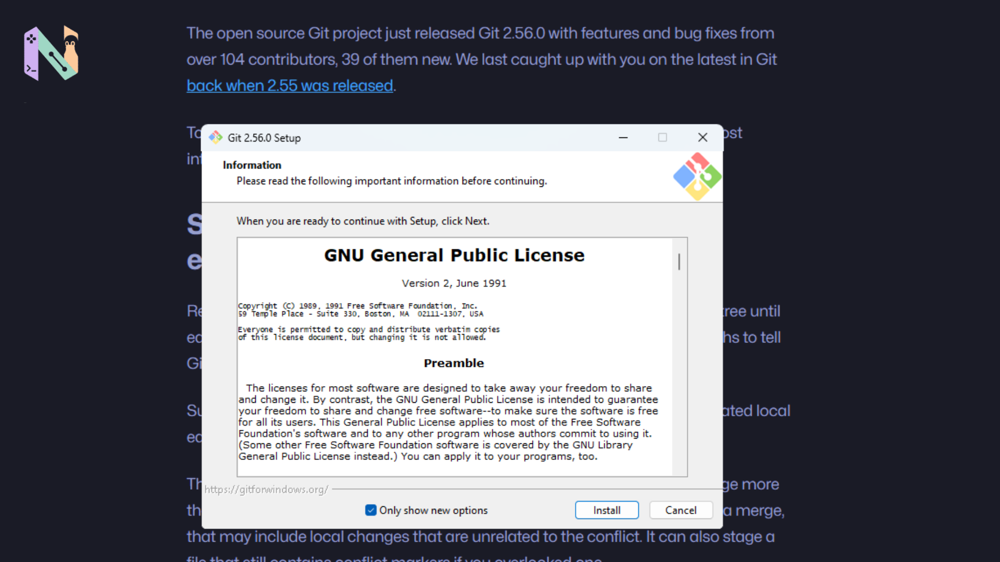

Git 2.56 sudah resmi dirilis. Update kali ini memang tidak mengubah cara kita menggunakan Git secara drastis, tetapi ada beberapa tambahan yang cukup fungsional kalau ente sehari-hari bekerja dengan repository.

Ane perhatiin, rilis kali ini lumayan banyak menyentuh urusan yang sering muncul dalam workflow harian, mulai dari beres-beres branch lokal sampai penanganan merge conflict.

## Lebih Gampang Bersihin Branch

Coba ngaku, siapa yang daftar branch lokalnya masih dipenuhi branch yang sudah di-merge berbulan-bulan lalu?

Nah, Git 2.56 membawa flag baru `--delete-merged` untuk `git branch`.

Sesuai namanya, opsi ini bisa digunakan untuk menghapus branch lokal yang sudah ter-merge ke remote-tracking branch. Jadi, daripada ngecek satu-satu branch mana yang sudah tidak diperlukan, proses bersih-bersihnya bisa dilakukan dengan lebih praktis.

Kelihatannya memang sederhana, om. Tapi kalau repository yang ente kerjakan sudah punya banyak branch, fitur kecil seperti ini lumayan terasa manfaatnya.

Ada perubahan lain yang berkaitan dengan `git branch -d`. Git sekarang bakal memberikan peringatan ketika ente mencoba menghapus branch yang sedang digunakan oleh `git bisect`.

Ngomong-ngomong soal `git bisect`, command ini juga mendapatkan opsi baru bernama `--reset-when-found`.

Opsi tersebut bisa membuat Git menjalankan `git bisect reset` secara otomatis ketika commit yang menjadi sumber masalah sudah ditemukan. Alurnya jadi lebih ringkas karena ente tidak perlu melakukan reset secara manual setelah proses bisect selesai.

## Bantu Amankan Saat Menyelesaikan Merge Conflict

Ngurusin merge conflict kadang memang bikin kepala panas, terutama kalau file yang berubah cukup banyak.

Di Git 2.56, `git add` mendapatkan opsi `--resolved` yang ditujukan khusus untuk kondisi seperti ini.

Dengan opsi tersebut, Git hanya akan melakukan staging terhadap file yang konfliknya sudah diselesaikan. Perubahan lokal lain yang tidak berkaitan dengan conflict tetap dibiarkan dalam kondisi un-staged.

Yang menarik, Git juga akan memeriksa apakah masih ada conflict marker yang tertinggal di file, misalnya `<<<<<<<`.

Kalau marker tersebut masih ditemukan, proses `git add --resolved` akan dibatalkan. Ini cukup berguna sebagai pengaman tambahan supaya marker conflict tidak ikut masuk ke commit hanya karena kita terburu-buru melakukan staging.

## Git Sekarang Lebih Paham Typo

Bagian ini mungkin terasa lebih dekat dengan kehidupan sehari-hari.

Pernah buru-buru ngetik `git push origin/main`, padahal maksudnya `git push origin main`?

Git 2.56 sekarang bisa mengenali beberapa pola typo semacam itu dan memberikan saran command yang kemungkinan sebenarnya ingin ente jalankan.

Perbaikan pada pesan `advice` juga muncul ketika menggunakan `git status`. Saat branch lokal berada dalam kondisi tertinggal atau diverged dari branch tujuan, Git bisa memberikan saran berupa command `git pull <remote> <branch>`.

Memang cuma berupa pesan di terminal. Tapi ketika lagi fokus ke kerjaan dan tiba-tiba lupa command yang harus dijalankan, pengingat kecil seperti ini bisa cukup membantu.

## Ada Juga Perubahan di Balik Layar

Tidak semuanya berhubungan langsung dengan command yang sering kita ketik.

Git 2.56 juga membawa mekanisme retry otomatis dalam waktu singkat ketika proses mencoba mendapatkan lock pada file konfigurasi. Perubahan seperti ini lebih terasa pada workflow yang melibatkan beberapa proses atau script yang bisa mengakses konfigurasi Git secara bersamaan.

Selain itu, command eksperimental `git history` sekarang mendapatkan subcommand `drop`. Fungsinya untuk menghapus sebuah commit sekaligus melakukan replay terhadap commit-commit turunannya.

Fitur semacam ini mungkin bukan sesuatu yang bakal dipakai setiap hari, apalagi kalau penggunaan Git ente sebatas menyimpan project pribadi. Tapi buat yang suka bereksperimen dengan fitur baru Git, bagian ini cukup menarik buat diulik.

## Jadi, Perlu Update?

Kalau ente cuma menggunakan Git untuk menyimpan beberapa project pribadi, mungkin sebagian besar perubahan di Git 2.56 tidak akan langsung terasa.

Tapi kalau sehari-hari berkutat dengan banyak branch, sering menyelesaikan merge conflict, atau cukup sering menggunakan `git bisect`, beberapa tambahan di versi ini memang menyentuh masalah yang cukup nyata dalam workflow.

Ane sendiri lebih tertarik dengan `--resolved` dan `--delete-merged`. Keduanya bukan fitur yang mengubah cara kerja Git secara besar-besaran, tetapi justru menyelesaikan pekerjaan kecil yang cukup sering muncul.

Dan biasanya, fitur kecil seperti inilah yang baru terasa berguna setelah benar-benar dipakai.

Kalau nanti ente nemu fitur lain dari Git 2.56 yang ternyata menarik setelah dicoba, tinggal kita ulik lagi.
