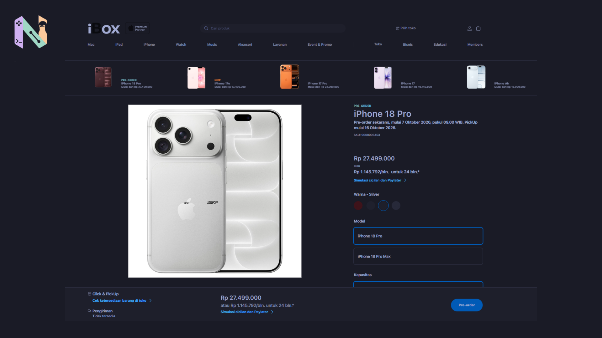
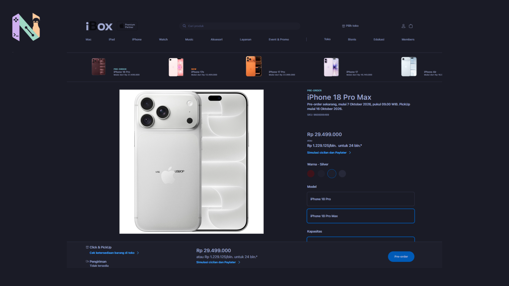

Pagi ini saya iseng mengecek situs beberapa distributor resmi Apple di Indonesia. Mengingat hari ini, 7 Oktober 2026, memang jadwal resminya keran pre-order iPhone 18 Pro dan 18 Pro Max dibuka.

Tentu saja hal pertama yang bikin penasaran adalah harganya.

Dari yang saya baca, Apple langsung membawa keempat pilihan kapasitas penyimpanan ke sini. Semuanya lengkap, mulai dari 256 GB, 512 GB, 1 TB, sampai yang paling besar 2 TB. Pilihan warnanya juga lumayan segar tahun ini, ada Burgundy, Glacier, Silver, dan Black.

Tapi, saat melihat-lihat daftar harganya, ada satu bagian yang bikin saya sedikit heran. Bukan soal perangkat dasarnya, melainkan biaya yang harus kita bayar kalau ingin kapasitas penyimpanan yang lebih lega.

## Biaya Naik Memori yang Terasa Jauh

Mari kita lihat iPhone 18 Pro versi biasa dulu. Untuk ukuran paling bawah, yaitu 256 GB, harganya dipatok di angka Rp27.499.000.

Lalu, kalau kita merasa 256 GB itu bakal cepat penuh dan ingin naik ke 512 GB (seharga Rp32.999.000), kita butuh tambahan dana sekitar Rp5,5 juta. Sampai di sini mungkin masih terdengar wajar untuk ukuran produk Apple.

Nah, yang agak bikin kaget adalah lompatan berikutnya. Dari 512 GB ke 1 TB, selisih harganya ternyata menembus Rp10 juta. Terus terang saya kurang tahu apakah ada perbedaan jenis teknologi memori yang dipakai di kapasitas 1 TB ke atas sehingga biayanya melonjak tajam, tapi selisih angka ini rasanya cukup terasa.

Biar lebih mudah membayangkannya, ini rincian harga iPhone 18 Pro:

- iPhone 18 Pro 256 GB: Rp27.499.000

- iPhone 18 Pro 512 GB: Rp32.999.000

- iPhone 18 Pro 1 TB: Rp42.999.000

- iPhone 18 Pro 2 TB: Rp56.999.000

## Selisih Konstan dengan Versi Pro Max

Setelah melihat-lihat versi Pro, saya lanjut mengecek harga iPhone 18 Pro Max.

Ternyata polanya jauh lebih sederhana untuk ditebak. Kalau diperhatikan, Apple mematok selisih angka yang sangat konstan antara iPhone 18 Pro dan Pro Max. Untuk kapasitas memori yang sama persis, selisihnya selalu pas di angka Rp2 juta.

Jadi, semisal layar versi Pro dirasa terlalu kecil dan kurang puas buat nonton atau main game, kita cukup siapkan tambahan dua juta untuk mendapat versi layar lebarnya.

Ini daftar harga untuk iPhone 18 Pro Max:

- iPhone 18 Pro Max 256 GB: Rp29.499.000

- iPhone 18 Pro Max 512 GB: Rp34.999.000

- iPhone 18 Pro Max 1 TB: Rp44.999.000

- iPhone 18 Pro Max 2 TB: Rp58.999.000

Masa pemesanan lewat situs resmi dan distributor ini sudah berjalan mulai hari ini. Tetapi kalau kamu ikut pre-order, unit barunya baru akan mulai dikirim atau bisa diambil secara fisik di toko pada tanggal 16 Oktober 2026 nanti.

Melihat selisih harga memori yang lumayan melompat tadi, sepertinya kita memang harus pintar-pintar memperkirakan kebutuhan memori jangka panjang sebelum memutuskan mau checkout varian yang mana.

Sumber: [Ibox](https://ibox.co.id/product/iphone-18-pro-s9600006453)
