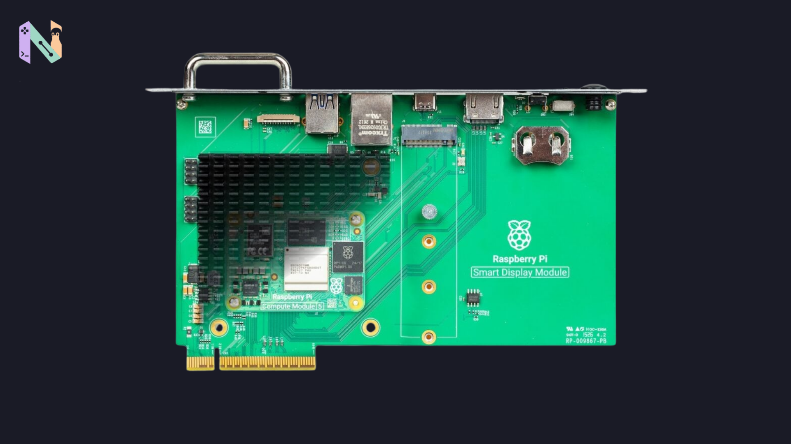

Raspberry Pi baru saja merilis perangkat keras baru yang kalau dilihat sekilas bentuknya mungkin biasa saja. Namanya Smart Display Module. Harganya lumayan murah, dipatok di angka Rp. 539.400. Tapi setelah membaca lebih jauh soal fungsinya, ternyata ada alasan menarik kenapa mereka merancang papan hijau ini.

Modul ini dirancang khusus untuk diselipkan ke dalam layar komersial atau proyektor yang mendukung standar Intel SDM.

Awalnya saya mikir, buat apa sih pakai modul adapter seperti ini? Ternyata masalah utamanya ada di urusan manajemen kabel. Biasanya, kalau kita melihat layar informasi digital di tempat umum, misalnya layar jadwal penerbangan di bandara atau papan reklame digital di mal, di balik layar itu ada komputer mini yang harus dipasang pakai *bracket*. Belum lagi butuh colokan daya sendiri dan juntaian kabel HDMI yang kadang bikin berantakan.

Nah, Raspberry Pi bekerja sama dengan Sharp untuk menghilangkan kerumitan itu. Cara kerjanya jadi jauh lebih rapi. Kita tinggal memasang Compute Module 5 (yang sayangnya harus dibeli terpisah) ke Smart Display Module ini. Setelah itu, seluruh perangkatnya tinggal ditancapkan langsung ke slot SDM yang ada di bodi layar komersial.

Dengan cara ini, Raspberry Pi langsung mendapat aliran daya dari TV atau layar tersebut, sekaligus mengirimkan output video 4K ke layarnya. Nggak butuh lagi adaptor daya eksternal atau kabel-kabel tambahan. Karena ditujukan untuk layar informasi yang menyala 24 jam sehari, desainnya sengaja dibuat tanpa kipas agar hening dan minim perawatan.

## Tetap Punya Slot M.2

Walaupun posisinya didesain untuk bersembunyi di dalam layar, bagian yang menurut saya cukup menarik adalah Raspberry Pi tetap menyertakan slot M.2 PCIe di papan ini. Jadi, slotnya tidak cuma bisa dipakai untuk menambah penyimpanan berkecepatan tinggi, tapi juga bisa dipasangi akselerator AI tambahan seperti prosesor Hailo.

Di luar konektor utamanya, pinggiran modul ini tetap menyediakan beberapa port standar jika suatu saat dibutuhkan, seperti:

- HDMI 2.0 (jika butuh output ke layar ekstra)
- USB 3.0 Type-A
- USB 2.0 Type-C (hanya untuk *programming* Compute Module)
- Port Gigabit Ethernet (RJ45)

Lucunya, Raspberry Pi sebenarnya sudah memamerkan modul ini sejak awal tahun, tepatnya saat pameran di Barcelona bulan Januari dan Februari lalu. Waktu itu mereka menjanjikan kalau produk ini bakal "segera" dirilis. Muncul di akhir September sih rasanya agak jauh dari kata segera, ya.

Untuk pemakaian komputer di rumah, perangkat ini rasanya memang terlalu spesifik dan belum tentu terpakai. Tapi buat teknisi yang sering mengurus instalasi *digital signage*, baru kelihatan kenapa desain tersembunyi tanpa kabel seperti ini dibuat.

*Sumber: Raspberry Pi News / Pengumuman Resmi Raspberry Pi SDM*
